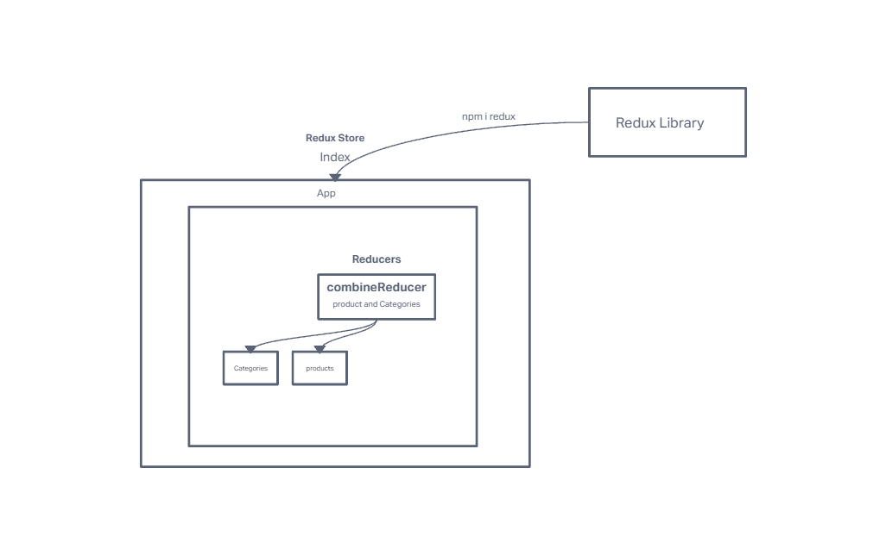

# Lab-36: Application State with Redux

- Phase 1 Requirements
  - Today, we begin the first of a 4-Phase build of the storefront application, written in React. In this first phase, our goal is to setup the basic scaffolding of the application with initial styling and basic behaviors. This initial build sets up the file structure and state management so that we can progressively build this application in a scalable manner
  
    - As a user, I expect to see a list of available product categories in the store so that I can easily browse products
    - As a user, I want to choose a category and see a list of all available products matching that category
    - As a user, I want a clean, easy to use user interface so that I can shop the online store with confidence

### `npm start`

Runs the app in the development mode.\
Open [http://localhost:3000](http://localhost:3000) to view it in your browser.

The page will reload when you make changes.\
You may also see any lint errors in the console.

### UML Design 

